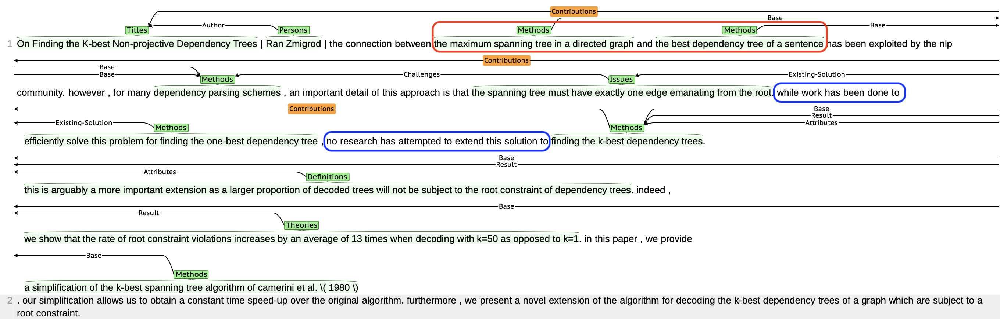

# Paper-KG  
Paper-KG For Conversational Paper Recommender Systems

* http://35.74.43.113/brat  
* http://35.74.43.113/README.html  

### Building Paper-KB rules based on Brat tool    

Maintain the grammar's coherence as much as possible.


#### Entities  

```Titles```: Recommendation ending.  
```Theories```: A theory can also be a conclusion. It may have been validated or may not have been validated yet.  
```Datasets```: Datasets or corpora.  
```Applications```: Tools or Apps.  
```Sectors```: For classification.   
```Definitions```: Explanation or addition, it is frequently a sentence.  
```Models```: It is usually to complete a specific task.  
```Methods```: A simple procedure or method.  
```Issues```: Unresolved or new concerns raised by the writers.  
```Tasks```: A new task usually comes with a new evaluation dataset or measure.  
```Evaluations```: Metrics for evaluation based on some benchmarks.  
```Persons```: Author (Lead author only).  


#### Relations  

```Contributions```:  e.g. Models -> Titles  
```Solution```: e.g. Models -> Issues  
```Existing-Solution```: e.g. Models -> Issues  
```Base```: e.g. Datasets -> Methods  
```classification```: e.g. Sectors -> Datasets  
```Attribute```: e.g. Definitions -> Models  
```Challenge```: e.g. Issues -> Sectors  
```Acronym```: e.g. Methods -> Methods  
```Result```: e.g. Evaluations -> Methods  
```Author```: e.g. Persons -> Titles  

Note: ```annotation.conf``` contains the detailed definitions.  

